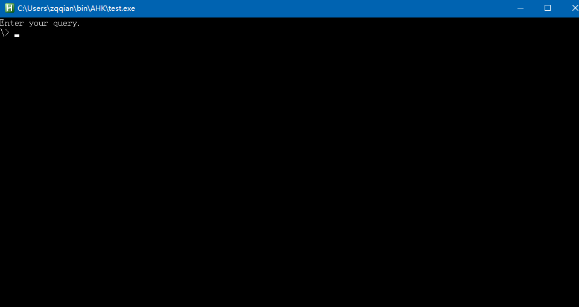
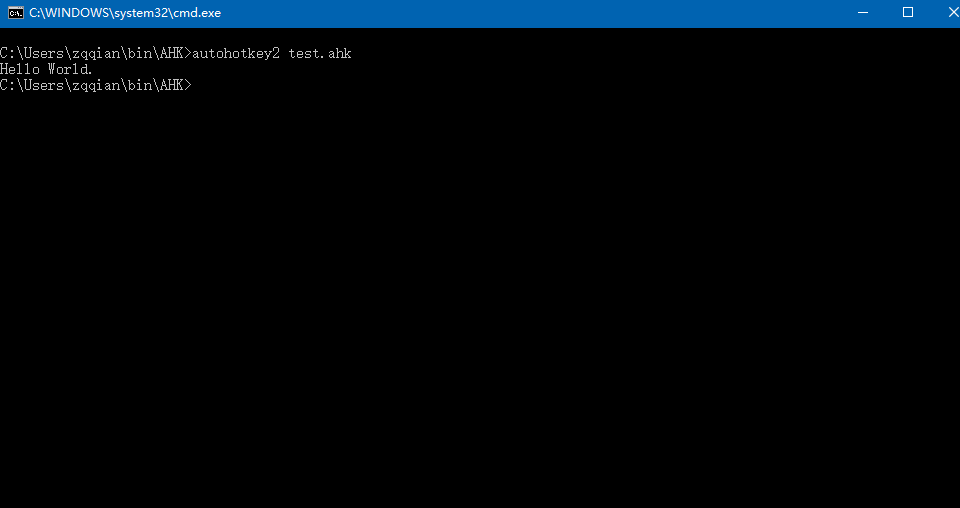
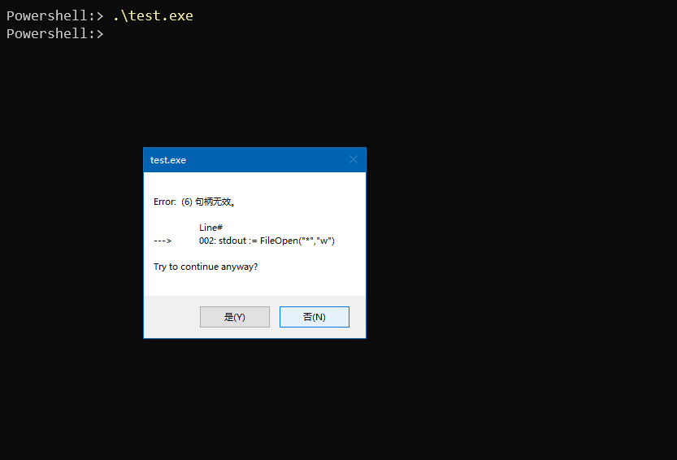
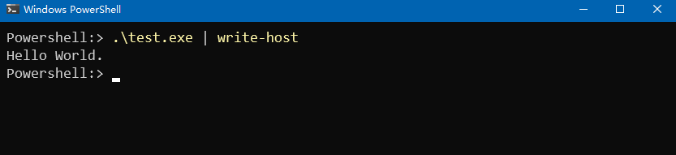
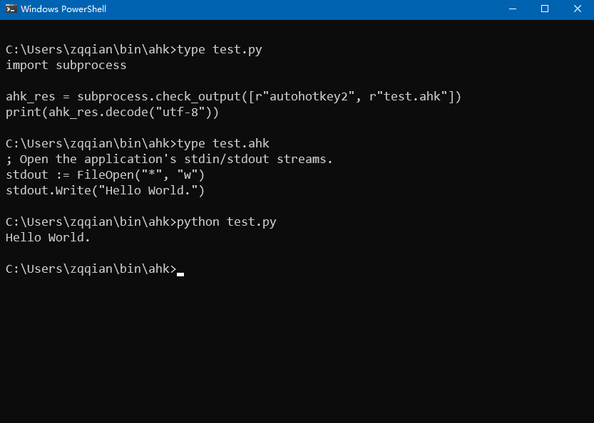

toc: true
title: AHK输出到当前命令行
date: 2022-04-28 19:06 
tags: [AHK, AllocaConsole, AttachConsole, Console]
description:

---

# AHK输出到当前命令行

autohotkey脚本是个GUI程序，本身没有console。因此需要输出到Stdout时，要么AllocConsole，要么AttachConsole。

下面的例子用到几个文件
```bat
    test.ahk : 测试用的ahk
    test.exe : 编译生成的exe
    test.py  : 配合测试的py
```
<!--more-->

# GUI环境启动AHK

如果在GUI环境启动一个autohotkey脚本，需要AllocConsole。

下面是AutoHokey V2帮助文件的例子

```autohotkey
DllCall("AllocConsole") ; 分配console

; Open the application's stdin/stdout streams.
stdin  := FileOpen("*", "r")
stdout := FileOpen("*", "w")

stdout.Write("Enter your query.`n\> ")
stdout.Read(0) ; Flush the write buffer.
query := RTrim(stdin.ReadLine(), "`n")
stdout.WriteLine("Your query was '" query "'. Have a nice day.")
stdout.Read(0) ; Flush the write buffer.

Sleep 5000
```


# 命令行启动AHK

如果在命令行启动autohotkey脚本，可以AttachConsole到当前的Console，也可以AllocConsole。

如果AllocConsole，效果和GUI下一样，会再开启一个Console。

```autohotkey
DllCall("AttachConsole", "uint", -1)

; Open the application's stdin/stdout streams.
stdout := FileOpen("*", "w")
stdout.Write("Hello World.")
```


# 不分配Console的结果

如果既不Alloc，也不Attach，而是直接输出到Stdout，无论在命令行还是GUI，运行都会报错。

```autohotkey
; Open the application's stdin/stdout streams.
stdout := FileOpen("*", "w")
stdout.Write("Hello World.")
```



命令行的时候可以通过管道分配一个Console，程序能正常运行。

```Powershell
test.exe | write-host
```



# 子进程分配Console

用python写个简单的测试程序，能在命令行正确运行，也能得到结果，原因是子进程调用autohoktkey时，分配了一个console，python捕捉到结果`ahk_res`，print到当前命令行。

```python
ahk_res = subprocess.check_output([r"autohotkey2", r"test.ahk"])
print(ahk_res.decode("utf-8"))
```



# 其它要注意的问题

有时从命令行上运行im-select2.exe时，下一条提示符比输出结果还要早，产生排版混乱，可以`start -wait test.exe` 或者 `test.exe | write-host`
