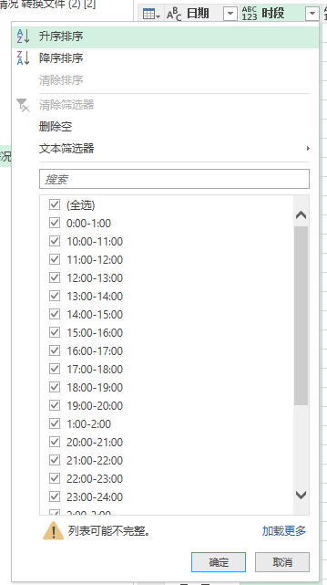

toc: true
title: Excel汇总整个文件夹数据
date: 2020-12-11 15:08
tags: [PowerQuery, Excel, 文件夹]
description: 

------

# 背景

年初写了一个用EXCEL汇总一个EXCEL中的多张表的数据，现在记录一下使用EXCEL汇总一个文件夹下多个相同结构的文件。仍然使用PowerQuery（PQ ）。  

<!-- more -->

# 合并表

在Excel中，数据选项卡，选择导入文件夹中文件的相关数据，如下图：

选择文件夹路径后，系统将读到的文件信息形成一张表，如下图，在这个界面上选择转换数据，得到一个文件夹下所有文件信息的表。

>这里的数据是一年汇总数据，每个月一个Excel文件，每个Excel文件中，每天一张Sheet，要汇总365张Sheet。

这张表我们感兴趣的是Content列，这列包含了所有的数据信息，右键选择该列，将其它列删除。

选择Content列右上角的深化按钮，合并文件

在合并文件对话框中，直接点击确定，系统将按照模板把所有数据合并在一张表中。

>上图中，可以看出，右边的应用步骤中，增加了很多默认的步骤，这些步骤有些多余，我们后面还会讲到。

我们感兴趣的是Name和Data列，Name是Sheet名，要合并的各个文件使用日期名做为Sheet名称，所以这一列是我们需要的日期信息，Data列包含了每张Sheet的数据信息。选择这两列，将其它列删除。

选择Data列右上角的深化按钮，进一步导入所需要数据。

这个对话框选择所需要的列，根据实际需要，我们选择列1，2，3，5，7，9，100，102，104共9列。

将这9列导入当前表，如上图。

# 数据整理和清洗

接下来就是数据整理和清洗，这一步需要结合业务需求，耐心细致，一步一步调整。通常而言，有几个方法必不可少：

1. 删除最前面或者最后面的行，这些行通常是标题或者汇总数据
2. 筛选选择需要数据、
3. 删除多余的列。

界面如下图，这里不再一一描述。

数据整理和清洗需要耐心细致，反复尝试，整个汇总过程最长的就是这一步。

数据清洗完成之后，得到一个干净的，我们想到的数据。

接下来就是更改数据类型，导入的数据默认都是文本类型，可以根据需要改成日期类型、整数类型和小数类型。

还可以添加计算列。

>根据我的经验，如果后续做数据透视表的时候需要计算平均值，那添加的计算列避免乘除运算，只做简单的加减运算。更复杂的公式可以在数据透视表的时候制作。

至此，完成了数据导入汇总。

# 进一步优化

如前所述，合并数据环节根据默认值导入的数据有多余的步骤和不必要的参数，可以进一步优化。

回到第二步，即只有Content那一步，将之后的步骤全部删除，添加一个计算列，取出Content列的内容。

如下图：列名可以为`Cutstom`，公式为`=each Excel.Workbook([Content])`，注意大小写，PQ的M语言区分大小写。

将Custom列展开，再将展开的Custom.Data列展开，就得到想要的数据。

合并数据完成。

