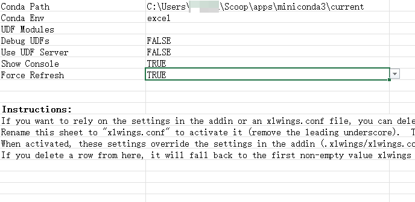
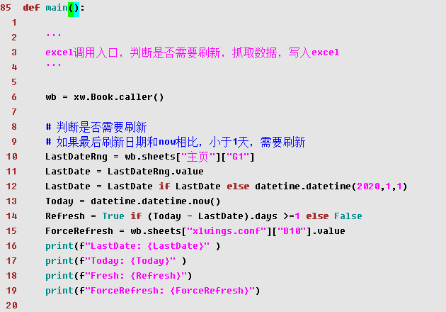

toc: true
title: Excel调用PlayWright
date: 2022-04-05 16:54
tags: [Excel, Playwright, xlwings]
description:

---

# Excel调用PlayWright

这是前两篇文章的继续，文章使用`Playwright`抓取动态网页，文章`PowerBI`抓取动态网页。今天是`Excel`通过`Playwright`抓取网页。

`PlayWright`本身支持`C#`和`python`，本来想使用`C#`的`VSTO`，结果VSTO只支持`.net`标准版，`Playwright`只支持`.net core`。

后来就找到了可以在`Excel`中调用`python`的`xlwings`。

<!--more-->

# 安装xlwings

```powershell
conda create -n excel python xlwings pandas
conda create -n excel python=3.9 xlwings pandas
```

新建一个`conda`环境，取名`excel`，安装`xlwings`和`pandas`两个包。

`xlwings`架起了`excel`和`python`的桥梁，使得`excel`通过VBA调用`python`，`python`也可以调用操作`excel`。
`pandas`处理网页返回的数据，并将数据通过`xlwing`写入`excel`。

# 环境搭建

```powershell
conda activate excel # 激活虚拟环境
cd path/to/project # 你要工作的目录
xlwings quickstart pyexcel -s # 这三句见下面的解释
打开pyexcel.xlsm，将sheet“_xlwings.conf”重命名为“xlwings.conf”
xlwings.conf中，填入conda path，虚拟环境选excel
```

`xlwings quickstart pyexcel` 新建名为`pyexcel`工程，`-s` 是将`xlwing`的`excel`插件写进文件里，可以独立运行，不需要`xlwing`插件，参见https://docs.xlwings.org/zh_CN/latest/addin.html 。

`xlwings`生成两个文件，`pyexcel.xlsm`和`pyexcel.py`。

将`pyexcel.xlsm`的`_xlwings.conf`页签更名为`xlwings.conf`，这是`xlwing`的配置文件。



> xlwings配置文件有三个级别，全局、文件簿目录级、文件簿级，参见https://docs.xlwings.org/zh_CN/latest/addin.html
> 全局配置文件为.xlwings\xlwings.conf in your home folder, that is usually C:\Users\<username>
> 文件簿目录配置文件为项目所在目录的xlwings.conf
> 文件簿级的配置文件为xlwings.conf页签
> 优先级别 文件簿 > 文件簿项目 > 全局

`pyexcel.xlsm`默认调用`pyexcel.py`中的`main()`，代码可以写在这里。



# 主要代码

```python

def main():
    wb = xw.Book.caller() # 调用python的excel实例
    wb.app.api.StatusBar = "抓取数据...." # wb.app.api对应了excel.Application
    GetPETTM() # 核心函数，抓取动态网页数据，并写进excel的table
    wb.app.api.StatusBar = False

    # excel刷新、透视表刷新
    # CalculateUntilAsyncQueriesDone等待异步刷新完成
    print("Excel refresh all")
    wb.api.RefreshAll()
    wb.app.api.CalculateUntilAsyncQueriesDone()
    print("Excel refresh pivottable")
    wb.sheets["主页"].api.PivotTables("数据透视表1").RefreshTable() #PivotCache.Refresh
    wb.save() # 存盘
```
wb.app.api和wb.api返回一个标准excel对象，后面调用的属性方法和VBA的相同。


```python
def response(res):
    global KeyResponse
    if TargetKeyword in res.url:
        KeyResponse = res


def GetPETTM():

    # 标准用法，参见xlwings官方文档。调用的excel或者Mock_caller
    wb = xw.Book.caller()
    pettm = wb.sheets["PETTM"]

    # playwrigth标准用法
    playwright = sync_playwright().start()
    browser = playwright.chromium.launch()
    page = browser.new_page()
    page.on("response", response)  # response将返回结果写入KeyResponse全局变量
    page.goto(URL)

    # 如果找到了Response
    if KeyResponse :

        # 取出其中的data
        p=KeyResponse.json()
        df=pd.DataFrame(p["data"])

        # 处理数据
        # df[date]是unix时间戳，毫秒计算，utc时区
        # 需要转换成datetime类型，时区转换要加上8小时
        df["date2"]=pd.to_datetime((df["date"]+8*3600*1000+24*3600*1000),unit='ms')
        # 转换成str，避免写入excel出现科学计数法
        df["date"] = "'" + df["date"].astype(str)

        # 写入excel，直接生成excel table
        # 这也是标准用法，在xlwings官方文档中有提及
        table_name = "MiddlePETTM"
        if table_name in [table.name for table in pettm.tables]:
            pettm.tables[table_name].update(df, index=False)
        else:
            pettm.tables.add(source=pettm['A1'].expand('table'), name=table_name).update(df, index=False)

    browser.close()
    playwright.stop()

```

在`excel`中，运行宏`SampleCall()`即可调用上面代码，最后生成`MiddlePETTM`的`execl table`。


