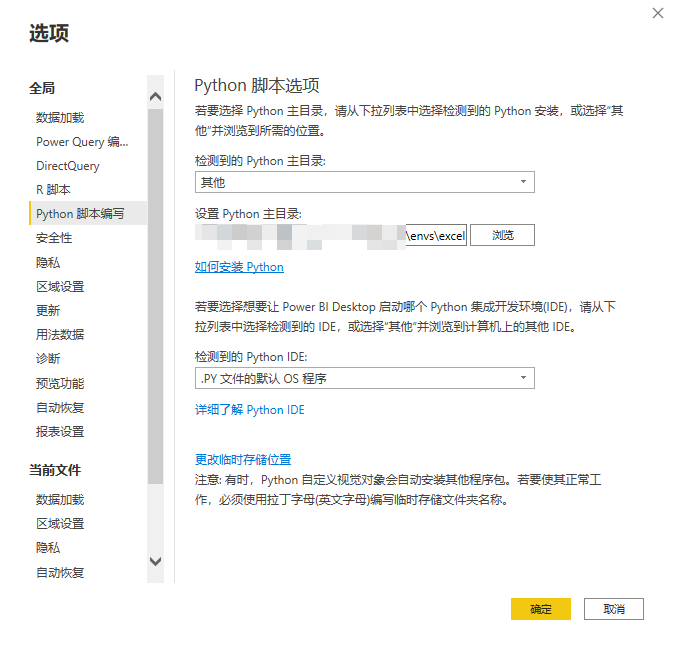
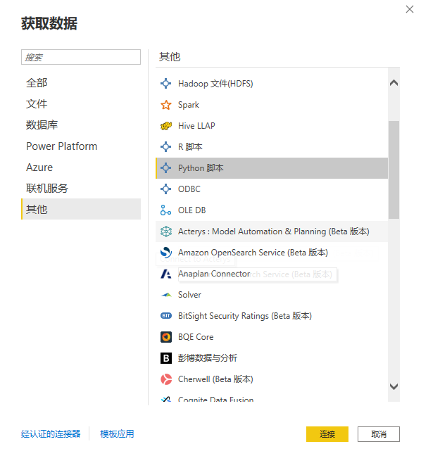

toc: true
title: PowerBI调用PlayWright
date: 2022-03-25
tags: [PowerBI, PlayWright]
description:

---

# PowerBI调用PlayWright

网页用XHR局部获取数据，要抓这样的数据，需要找到XHR的URL，这样的URL一般包括token，一段时间后就失效，因此需要动态抓取网页发起的请求。

PowerBI运行Python脚本抓取网页，如果碰到动态网页的情况，可以使用PlayWright监控网页发起的request，找到需要的request后，处理相应response数据，返回PowerBI。

<!--more-->

# 环境

安装conda，再安装playwright、pandas、numpy、matplotlib等包

其中pandas、matplotlib是必装的，因为PowerBI做了一个wrapper，import了os、pandas和matplotlib。安装pandas附带安装了numpy。

playwright是这次要用的包。


```powershell
conda create -n excel pandas matplotlib playwright
conda activate excel
```

PowerBI设置中配置好python的主目录。如果用虚拟环境，就配置虚拟环境的主目录。



# 解决NUMPY报错

引入Python虚拟环境时，低版本（1.22版本以前）numpy，import的时候会报找不到dll的错误。

```
***\envs\excel\python.exe -c "import numpy"

Original error was: DLL load failed while importing _multiarray_umath: 找不到指定的模块。
```

安装1.22以后版本的numpy能解决问题。

如果一定要使用低版本的numpy，则可以拷贝所有的`mkl_*.dll`到`numpy`目录

```powershell
copy ***\envs\excel\Library\bin\mkl_*.dll ***envs\excel\Lib\site-packages\numpy\core
```
> 参考：https://stackoverflow.com/questions/36778066/importerror-dll-load-failed-when-importing-numpy-installed-in-conda-virtual-env


# 脚本

在PowerQuery中新建一个查询，数据源选Python。



在弹出的对话框中输入Python脚本。

```python

from playwright.sync_api import sync_playwright
import pandas as pd

key_res = None

def response(res): # 回调函数有时间限制，不能做太复杂的动作
    global key_res 
    if "KEYWORD" in res.url:
        key_res = res  

playwright = sync_playwright().start()
browser = playwright.chromium.launch()
page = browser.new_page()
page.on("response", response) 
page.goto("https://URL")

if key_res: # 处理response数据
    p=key_res.json()
    df=pd.DataFrame(p["data"])

browser.close()
playwright.stop()
```

代码还是比较简单，基本上和PlayWright教程差不多。

要注意一点，`page.on`的回调函数`response`有时间限制，解析`response.json()`这样的操作都有可能超时。

可以先将`response`取出来，`page.goto`全部完成之后，再处理`response`的数据，并赋值给`df`，返回`PowerQuery`。
