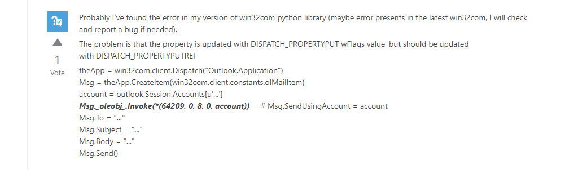
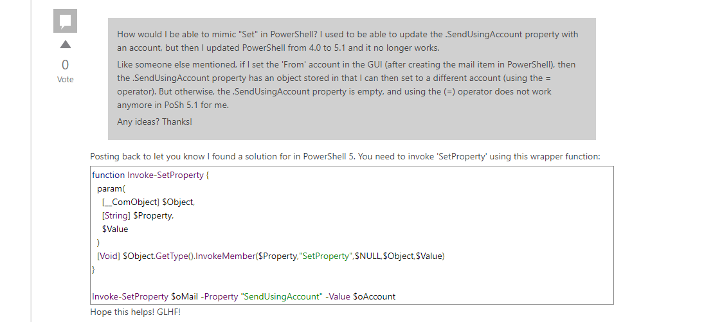

toc: true
title: Powershell调用Outlook的SendUsingAccount无效的解决方法
date: 2019-11-09 08:51
tags: [Powershell, com, sendusingaccount]
description: 

------

# 背景

原来有个powershell脚本，供Totalcmd调用，可以将TC中选择的文件（列表）做为附件生成outlook邮件，并自动填写主题subject。这个程序一直运行的很好，后来又用ahk和python写了类似的脚本。

三个脚本中，powershell速度最慢，而且会有命令行窗口弹出，而ahk和python相对速度会快一点。

<!-- more -->

下面贴出三个代码

```powershell
$outlook = new-object -com outlook.application
$mail = $outlook.CreateItem(0)

$mail.Subject = $args[0]
foreach ( $file in $args[1..($args.count-1)] )
{
    $mail.Attachments.add($file) | Out-Null
}
$mail.Display()
return
```

```autohotkey
Outlook := ComObjCreate("Outlook.Application")
Mail := Outlook.CreateItem[0]
m = %1%
Mail.Subject := m
Loop %0%  ; 
    ifnotequal, A_index, 1
        Mail.Attachments.add(%A_Index%)
Mail.display()
```

```python
from win32com.client.gencache import EnsureDispatch as Dispatch 
outlook = Dispatch("Outlook.Application")
ma = outlook.CreateItem(0) 
ma.Subject = "test" 
ma.To = "c@c" 
ma.Attachments.Add("C:/BOOTNXT") 
ma.Attachments.Add("C://BOOTNXT")
ma.Display()
```

# 起因

从上面的代码可以看出，createitem是用默认账号生成邮件。我的outlook一直只有一个账号，直到有一天我有添加了一个账号，并把新的账号做为默认账号，上面的脚本使用新的默认账号生成邮件，而不是用原来的账号。

脚本需要增加使用指定账号生成邮件的功能。google后，很容易就找到设置`mail.SendUsingAccount`属性为指定账号就可以了。

在ahk上很快通过

```autohotkey
Mail.SendUsingAccount := Outlook.Session.Accounts.Item("designated.account@mailbox.com")
```

但是ps和py用上面的方法始后，还是显示SendUsingAccount为空。

如果我在outlook界面上修改发送账号，如下图，改变发件人，可以修改发送账号，SendUsingAccount会跟着改变，并且用上面的方法也可以修改SendUsingAccount的值。似乎在SendUsingAccount为空的情况下会赋值失败，直到SendUsingAccount有了初始值以后，才能正确赋值。


这个兄弟的遭遇和我一摸一样


我觉得这是Outlook一个BUG!!

# 解决

经过艰难搜索，用了各种关键字，最终通过搜索python找到了一个帖子


```
https://social.msdn.microsoft.com/Forums/windows/en-US/7afc9e42-ca4f-491b-8c50-19556fb4e1cf/sendusingaccount-does-not-work-in-outlook-2010-possible-bug?forum=outlookdev

```

解决方法分别为。



```python
account = outlook.Session.Accounts.Item("designated.account@mailbox.com")
ma._oleobj_.Invoke(*(64209, 0, 8, 0, account))     # ma.SendUsingAccount = account
```



```powershell
$account = $outlook.Session.Accounts.Item("designated.account@mailbox.com")
$mail.GetType().InvokeMember("SendUsingAccount","SetProperty",$NULL,$mail,$account)
```

通过帖子，隐约猜到应该是传值和传指针的问题，至于为什么，我也不知道。

# 感想

这次找解决方案，原来主要方向是通过powershell寻找，毕竟powershell和outlook都是微软的产品，技术文档应该更全一点。可事实偏偏是python的解决方法更加容易找到。Powershell功能强大，用过的人都说好，但毕竟还是用户太少，导致很多问题都找不到答案，官方的论坛和技术支持的回答过于官方，不能解决问题。推广Powrshell以及跨平台的Powershell Core仍然任重道远。


