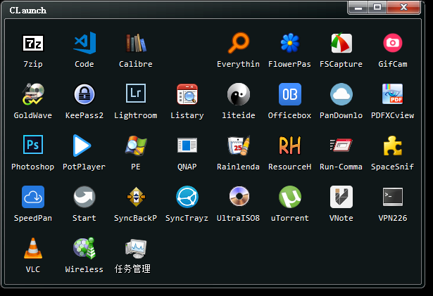
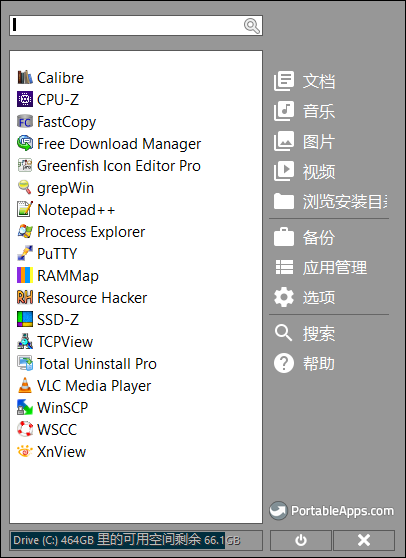
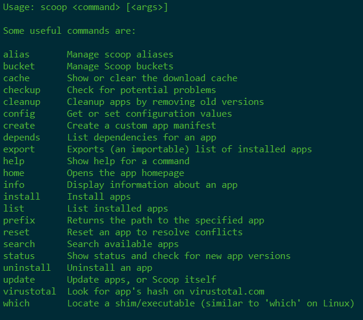

toc: true
title: Scoop引发的命令行工具
date: 2019-03-14 20:28
tags: [scoop, 命令行]
description: 

---


# 目前在使用的windows包管理工具

Windows10系统，正常安装的只有office，其它都是绿色软件或者使用包管理工具管理。

<!--more-->

## 绿色软件管理

日积月累收集了很多绿色软件，这些软件都不用安装，配置保存在程序所在目录，对系统无污染，装进U盘拿到另外一台机器上立刻可以使用。

然而软件众多，每个软件都只有一个启动程序，如果能在统一的地方管理看到这些软件，类似于windows的开始菜单，那就更加方便锦上添花了。

最简单就是快捷方式，创建每个应用软件的快捷方式，并将所有快捷方式集中在一个目录中，似乎也能达到目的。然而快捷方式中使用的只能是绝对路径，拿到另外一个机器上就失效了。

然后就是各类启动软件，最后找到了老牌启动软件`CLaunch`，有三个特点完全满足我的需求

1. 支持拖拽，把程序拖进窗口就能创建启动项。
2. 支持相对路径，而且可以一键将绝对路径转换成相对路径。
3. 可以配置命令行启动参数，不需要常驻内存。



我日常用`autohotkey`注册了一个快捷键启动`CLaunch`，最常用的程序定义了快捷键，可以做到三键启动一个程序。

## PortableApps

上述的绿色软件如果要升级的话，全是手工寻找安装，比较麻烦。就想到了`PortableApps`，也是一个老牌管理软件。从名字就可以看出这是一个便携软件管理软件，支持应用软件的安装、卸载、升级，也很好用。



如果说缺点的话，就是通过`PortableApps`启动的应用软件，如果非正常关闭，就会在`AppData`中留下配置信息，不过这点也可以接受。

## 命令行工具管理

一开始使用大名鼎鼎`Chocalate`，然后实在受不了它每安装一个应用软件，就在`PATH`中写入一堆路径，导致`PATH`越来越长。后来看到了`Scoop`，官网自豪的强调`Scoop`不会污染`PATH`。

使用了以后，发现果然如此。除了这个优点之外，即使将应用软件卸载，它还可以持久保存相应应用软件的配置文件，设计十分精巧。

这是`Scoop`支持的命令，基本也算中规中矩。



# 几个命令行工具

安装好`Scoop`以后，仔细学习了自带的几个工具，又一次扩大了眼界。

## z

`z`在Ubuntu下经常使用，可以很方便的在目录中跳转，`Scoop`包含了`z`，一个命令`Scoop install z`安装完成。Windows下的`z`只支持在`Powershell`使用。

## Cmder

Windows DOS和Powershell窗口的最佳替代者，可以使用`solarized`配色，支持`readline`库，可以保持linux命令行的操作习惯。原来我是做为绿色软件管理的，发现在`Scoop`下也有的时候，就迁移过来，这样日后升级就很方便了。

`Cmder`的配置文件做了持久化处理，但是其中的`ConEMU`的配置文件在`ConEMU`的目录中，需要单独备份，否则可能会丢失，期待`Scoop`能解决这一问题。

## Bat

`cat`替代者，可以显示语法高亮，需要安装`less`支持分页。

## fzf

模糊搜索工具，配合PSFzf，fzf-vim可以生成很多好用的场景。我用的最多的就是搜索历史命令，比`readline`自带的好了很多。

`PSFzf`在powershell下通过`install module`安装。

`fzf-vim`需要同时`git clone` `fzf` `fzf-vim`两个库做为`VIM插件才可以使用。

## 为了升级方便而迁移过来的软件

原来是做为绿色软件管理，为了方便升级而迁移过来应用软件，有`VIM`，`AutoHotKey`，`Git`，`typora`，`syncbackpro`等等。

在新版的`typora`中可以指定插入图片的位置，于是我按照`hexo`的要求，定制了图片的插入目录，这样就可以在`typora`中愉快的写BLOG了。


## VIM

使用`Scoop`安装的`GVIM`在命令行下很好用，但是在图形界面使用的时候，总会有DOS窗口一闪而过，那是`Scoop`在`GVIM`外又包裹了一层`DOS`程序，放在`~/scoop/shim`下，而`~/scoop/shims`又在`PATH`路径中，这也是`Scoop`号称不污染`PATH`的原因。其实仔细看一下`shims`的内容，每个应用程序由三个文件组成，以`GVIM`为例，为`gvim.exe`，`gvim.shim`和`gvim.ps1`，`gvim.exe`是DOS命令行程序，`gvim.shim`中包含实际的gvim.exe的绝对路径，推测DOS程序`gvim.exe`是一个通用程序，它读取同名的`shim`中的内容，然后启动相应程序。而`gvim.ps1`是一个powershell脚本，用在powershell环境中。

知道了原理，那么自己写一个GUI的包裹程序就可以了。我用autohotkey写了一个脚本，然后转换成exe程序，替换上面的dos程序完工。

```autohotkey
; 替换scoop/shims的命令行包裹程序
; 使得在GUI运行时不会有DOS窗口一闪而过

; 读取同一目录下的同名shim文件
; 运行文件指向的exe应用程序

SplitPath, A_ScriptFullPath, name, dir, ext, name_no_ext, drive
Loop, read, %dir%\%name_no_ext%.shim ; 同一目录下的同名shim
{
    Line := A_LoopReadLine
    IfInString, Line, path ; 当前行是否含有path
    {
        StringSplit, C, Line, = ; 用等号分割当前行
        app := trim(c2) ; 第二个字段为exe应用程序路径
    }
}

; 处理命令行参数
Params = 
loop, %0%
{
    p := %A_index%
    Params = %Params% "%p%"
}

; 运行
Run, %app% %Params%, , UseErrorLevel
if ErrorLevel = ERROR
    MsgBox Check .shim file with same name in scoop/shim`n"path" point to correct app in .shim file

```


