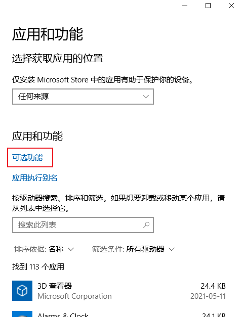
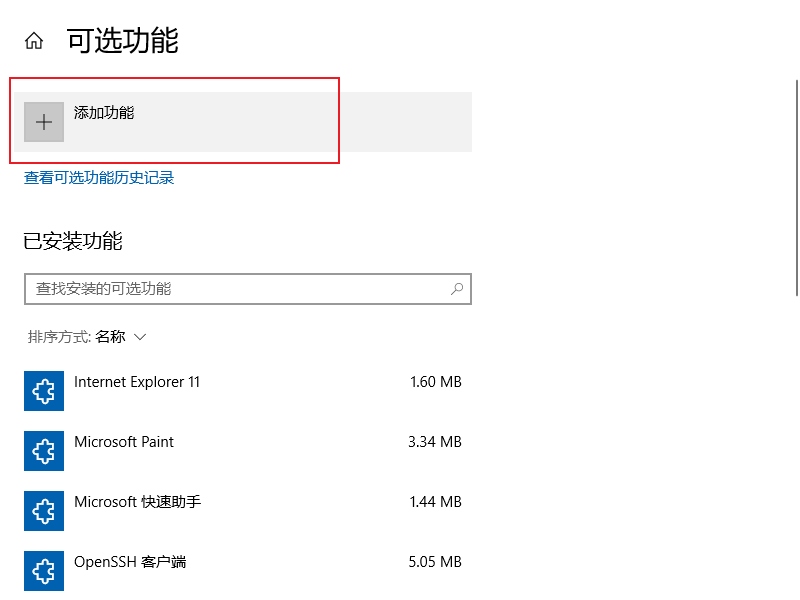
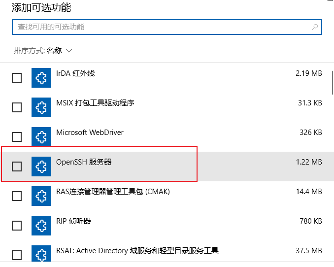

toc: true
title: Win10开通SSHD
date: 2021-10-05 14:30 
tags: [win10, ssh, powershell, vim]
description:

---

# Win10开通SSHD

目标：win10开通sshd，自动登录，默认powershell。

实际用下来，ssh远程到win10的powershell下，比powershell自身的远程兼容性还要好。比如，很多终端应用，比如vi，在powershell自身远程下不能使用，但在ssh远程powershell下应用正常。

<!--more-->

# 安装SSH服务端

很简单，`设置` - `应用` - `可选功能` - `添加功能`







一路安装，安装完成之后，在`服务`中启动openssh，并设置开机自启动。

# 默认SHELL为Powershell

管理员权限Powershell

```
New-ItemProperty -Path "HKLM:\SOFTWARE\OpenSSH" -Name DefaultShell -Value "C:\Windows\System32\WindowsPowerShell\v1.0\powershell.exe" -PropertyType String -Force
```

# 自动登录

Win10 SSHD的配置文件路径为`C:\ProgramData\ssh\`，其余操作和Linux下差不多

修改sshd_config

```
确保以下2没有被注释
PubkeyAuthentication yes
AuthorizedKeysFile	.ssh/authorized_keys

确保以下2条有注释掉
#Match Group administrators
#       AuthorizedKeysFile __PROGRAMDATA__/ssh/administrators_authorized_keys
```

顺便也可以修改以下参数
```
UseDNS no # 忽略DNS搜索，可以加快登录SSH
Port 22 # SSH端口号，可以根据需要修改
```

在需要免密登录的客户端上生成公钥，将生成的公钥拷贝至服务端。进入服务端复制公钥文件内容，到服务端C:\Users\your_userName\.ssh下创建文件authorized_keys（没有文件后缀），粘贴公钥，保存退出。如果已经有authorized_keys，则将公钥文件内容粘贴到文件末尾。

如何在客户端生成公钥，Win10的操作和Linux的操作一样，可以搜索ssh 免密登录，教程文章有很多，这里不再赘述。

完工！