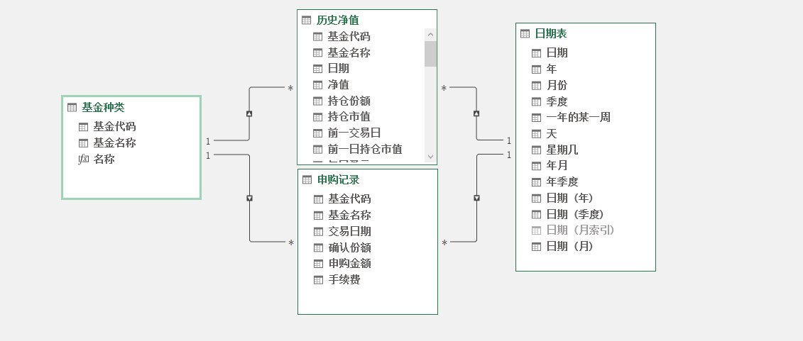

toc: true
title: 使用DAX计算基金收益
date: 2021-05-05
tags: [DAX, 基金, EXCEL]
description:

---

# 使用DAX计算基金收益

尝试用EXCEL记录基金的申购数据，用PowerQuery抓取基金历史净值，用PowerPivot计算基金收益。

所以这些都可以在一个EXCEL中完成。

<!--more-->

# 模型，表和关系

## 1. 申购记录

申购记录表是日常记录申购过程的表，包括6个字段。

```
基金代码、基金名称、交易日期、确认份额、申购金额、手续费
```

其中
`申购金额`减去`手续费`是购买基金的市值，比如投资5000，手续费50，则购买的基金市值为4500。
这张表是填写的，记录了每一笔申购，包括基金分红，因为基金分红会引起基金份额变动。基金分工的申购金额和手续费都为0。

## 2. 历史净值

包括字段

```
基金代码、基金名称、日期、净值
```

根据申购记录，抓取基金的历史净值。

## 3. 基金清单

包括字段

```
基金代码、基金名称
```

所有已申购的基金清单，是根据申购记录自动生成。

## 4. 日期表

包括

```
日期、年、月、日等
```

日期表是连续日期，包括非交易日的日期

## 关系
```
日期表（日期） - 申购记录（交易日期）
日期表（日期） - 历史净值（日期）
基金清单（基金代码） - 申购记录（基金代码）
基金清单（基金代码） - 历史净值（基金代码）
```

如下图




# 度量值

## 持仓类度量值

```
持仓总成本、持仓总份额、最新净值、持仓总市值、持仓总收益、持仓收益率、持仓年化收益率
```

## 期间类度量值

```
期初净值、期初份额、期初市值、期末净值、期末份额、期末市值、期间成本、期间收益、期间收益率
```

两者区别：
+ `持仓类`度量值是从持仓起一直到需要统计的时间，比如`2021-1-1`开始持仓、统计到`2021-3-31`的指标值
+ `期间类`度量值是一个时间段之间的指标值，比如统计2021年2月份的指标值，即`2021-2-1到2021-2-28`的指标值
+ 所有度量值都要支持单个基金和所有基金的汇总

这一篇文章讲持仓类度量值算法，下一篇讲期间类度量值算法。

# 持仓类度量值

## 最新净值

最新净值计算比较复杂，要考虑到没有交易的日期，还要考虑最后交易日比统计日期范围都要早的情况。

最终统计逻辑为

**`各类筛选器指定的日期范围，比最后日期早的最后一个交易日对应的历史净值`**

+ 情形一：计算年初到2021年2月份的各类指标，2月份最后一天是`2021-2-28`周日，非交易日，最新净值应该是`2021-2-26`的净值。`2021-2-26`是比`2021-2-28`早的最后一个交易日。
+ 情形二：统计范围`2021-4-10`到`2021-4-11`的指标，`2021-4-11`是非交易日，最新净值应该是`2021-4-9`的净值，比统计范围还要早。


```
最新净值:=
VAR v = // 计算比最后日期早的最后一个交易日
    CALCULATE(
        MAX( '历史净值'[日期] ),
        FILTER( ALL( '日期表'[日期] ), '日期表'[日期] <= MAX( '日期表'[日期] ) )
    )
VAR w = // 日期等于`v`的历史净值，如果是汇总行，包括了多个基金，会返回多个净值，这里返回基金的个数，也可以返回空值
    CALCULATE(
        IF( HASONEVALUE( '历史净值'[净值] ), VALUES( '历史净值'[净值] ), COUNTROWS( '历史净值' ) ),
        FILTER( ALL( '日期表'[日期] ), '日期表'[日期] = v )
    )
RETURN
    w
```

另一种算法：找出所有比最后日期早的历史净值表，找出这张表的最大日期对应的净值
```
最新净值2:=
VAR v =
    CALCULATETABLE(
        '历史净值',
        FILTER( ALL( '日期表'[日期] ), '日期表'[日期] <= MAX( '日期表'[日期] ) )
    )
VAR x =
    MAXX( v, [日期] )
VAR s =
    FILTER( v, [日期] = x )
VAR t =
    SELECTCOLUMNS( s, "净值", [净值] )
RETURN
    t
```

## 持仓总份额

所有申购记录的确认份额累加

```
持仓总份额:=
CALCULATE(
    SUM( '申购记录'[确认份额] ),
    FILTER( ALL( '日期表'[日期] ), '日期表'[日期] <= MAX( '日期表'[日期] ) )
)
```

## 持仓总成本

所有申购记录的申购金额累加

```
持仓总成本:=
CALCULATE(
    SUM( '申购记录'[申购金额] ),
    FILTER( ALL( '日期表'[日期] ), '日期表'[日期] <= MAX( '日期表'[日期] ) )
)
```

## 持仓总市值
持仓总份额*最新净值，考虑到汇总行，需要对不同的基金累加


```
持仓总市值:= SUMX( '基金清单', [持仓总份额] * [最新净值] )
```

## 持仓总收益

持仓总市值 - 持仓总成本

```
持仓总收益:= [持仓总市值] - [持仓总成本]
```

## 持仓收益率

持仓总收益 / 持仓总成本，这里用安全的除法函数DIVIDE，可以处理除零的情况

```
持仓收益率:= DIVIDE( [持仓总收益], [持仓总成本] )
```

## 持仓年化收益率

### 持仓年化收益率简化版

计算每天收益率*365天，即年化收益率

```
每天收益率 = 持仓总收益 / 持仓时间
持仓时间 = 最后交易日 - 首次交易日
最后交易日 = 日期表所有时间范围的最大历史净值日期，如果比首次交易日还要早，则等于首次交易日
首次交易日 = 持仓总份额大于0的最小时间
```

### 首次交易日

```
首次交易日:=
CALCULATE( MIN( '日期表'[日期] ), FILTER( ALL( '日期表' ), [持仓总份额] > 0 ) )
```

### 最后交易日

```
最后交易日:=
VAR v =
    CALCULATE(
        MAX( '历史净值'[日期] ),
        FILTER( ALL( '日期表'[日期] ), '日期表'[日期] <= MAX( '日期表'[日期] ) )
    )
VAR t = [首次交易日]
RETURN
    IF( v < t, t, v )
```

### 持仓时间

```
持仓时间:= DATEDIFF( [首次交易日], [最后交易日], DAY ) + 1
```

### 持仓年化收益率（简化）

```
持仓年化收益率（简化）:= DIVIDE( [持仓收益率], [持仓时间] ) * 365
```

## 持仓年化收益率

使用函数XIRR计算年化收益率，具体可以看excel的XIRR的说明。需要动态生成XIRR所需要的表。

```
持仓年化收益率:= 
VAR _f =
    // 取消日期表的最小值限制，比如原范围是2021-4-1到2021-4-30，则_f的范围是所有小于2021-4-30的日期
    CALCULATETABLE(
        '申购记录',
        FILTER( ALL( '日期表'[日期] ), '日期表'[日期] <= MAX( '日期表'[日期] ) )
    )
VAR _t =
    // 取其中日期和金额两列
    SELECTCOLUMNS( _f, "日期", '申购记录'[交易日期], "金额", '申购记录'[申购金额] * ( -1 ) )
VAR _t1 =
    // 最后交易时间
    CALCULATE(
        MAX( '历史净值'[日期] ),
        FILTER( ALL( '日期表'[日期] ), '日期表'[日期] <= MAX( '日期表'[日期] ) )
    )
VAR _t2 = [持仓总市值]
VAR _t3 =
    UNION( _t, ROW( "日期", _t1, "金额", _t2 ) )
VAR _t4 = [期末份额]
RETURN
    IF( _t4 = 0, BLANK(), XIRR( _t3, [金额], [日期] ) )
```

