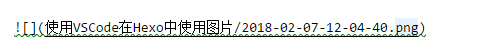
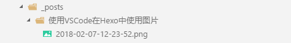

toc: true
title: 使用VSCode在Hexo中使用图片
date: 2018-02-07 11:54
tags: [vscode, hexo , 图片]
description:

---

# 使用VSCode在Hexo中使用图片

在hexo使用图片是一件困难的事情，要配置合适的编辑器，还要配置合适的插件，才能做到编辑的时候可预览，发布的时候图片正确。
编辑器选择vscode，hexo增加codefalling的[插件](https://www.tuicool.com/articles/umEBVfI)

<!--more-->

# vscode的配置:paste image插件

在扩展中新增paste image插件，这个插件可以从内存中黏贴图片，存到你指定的位置，并在md文档中插入图片的url，url格式你也可以指定。

配置如下

```json
{
    "pasteImage.path": "${currentFileDir}/${currentFileNameWithoutExt}"
}
```

指定图片存放位置为：当前文件所在目录，以当前文件名命名的子目录。

url默认为以当前文件名命名的目录。

使用的时候，先截屏到内存（我用snipaste截屏），然后快捷键`ctrl-alt-v`保存图片并且插入图片url。

插入的URL格式：




图片存放位置：



# hexo配置

直接引用作者的[文章](https://www.tuicool.com/articles/umEBVfI)

首先确认`_config.yml`中有`post_asset_folder:true`

在 hexo 目录，执行

``` bash
npm install https://github.com/CodeFalling/hexo-asset-image --save
```

假设在

``` bash
MacGesture2-Publish
├── apppicker.jpg
├── logo.jpg
└── rules.jpg
MacGesture2-Publish.md
```

这样的目录结构（目录名和文章名一致），只要使用 `` 就可以插入图片。

生成的结构为

``` bash
public/2015/10/18/MacGesture2-Publish
├── apppicker.jpg
├── index.html
├── logo.jpg
└── rules.jpg
```

同时，生成的 html 是

``` html

```

而不是愚蠢的

``` html

```