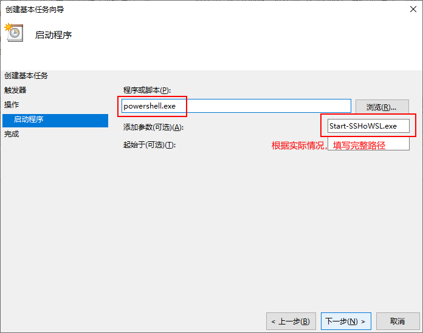
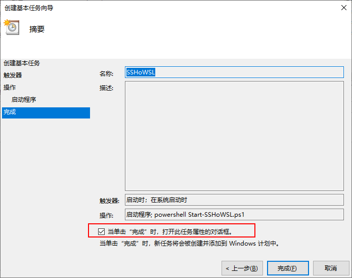
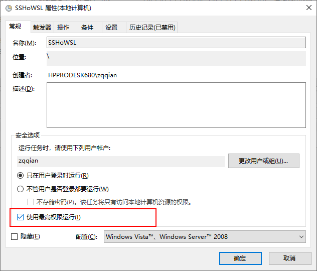

toc: true
title: 开机启动WSL2的SSHD服务
date: 2021-01-24
tags: [WSL, SSHD, PowerSHELL]
description: 

------

# 背景

使用WSL2来测试、培训LINUX，实际使用中总是希望能SSH到别的机器，这就需要开机自动启动SSHD的功能，并且WINDOWS可以把SSH端口暴露在局域网上。

<!-- more -->

# 使用wsl.exe命令开启SSHD

下面的操作都是在powershell管理员权限环境中操作。

```
wsl.exe -D ubuntu-18.04 -u root -- service ssh start
```

sshd成功运行之后，在windows中，将sshd端口（这里默认是22端口）映射到了127.0.0.1的22端口，只能在windows本机访问localhost，不能通过网卡地址访问，更不要说局域网访问。

```
netstat -ano -p TCP | sls 22

    TCP    127.0.0.1:22           0.0.0.0:0              LISTENING       11956
```

网上查了点资料，使用netsh可以进行端口映射。但是直接映射到`127.0.0.1:22`不成功，只能映射到WSL分配到的IP，这个IP是动态的，每次WSL重启都不一样。可以在WSL中用`hostname -I`获得分配到的IP地址，然后进行映射。

```
$wslIP = wsl.exe -- hostname -I 
netsh interface portproxy add v4tov4 listenport=22 connectaddress=$wslIP connectport=22
```

配置以后，windows暴露了端口0.0.0.0:22，并且映射到了$wslIP:22，通过本机网卡IP地址可以正常访问。

```
netstat -ano -p TCP | sls 22

    TCP    0.0.0.0:22             0.0.0.0:0              LISTENING       4528
    TCP    127.0.0.1:22           0.0.0.0:0              LISTENING       11956

netsh interface portproxy show all

    侦听 ipv4:                 连接到 ipv4:

    地址            端口        地址            端口
    --------------- ----------  --------------- ----------
    *               22          192.168.118.220 22

```

可是通过局域网还是不能访问，需要开放windows防火墙`0.0.0.0:22`端口

```
New-NetFirewallRule -DisplayName "Allow WSL Inbound Port 22" -Direction Inbound -Action Allow -Protocol TCP -LocalPort 22
```

将上面涉及到的命令组成powershell脚本`Start-SSHoWSL.ps1`，今后可以自动运行

```
wsl -u root service ssh start
$wslIP = wsl -- hostname -I
$wslIP = $wslIP.Trim()

netsh interface portproxy add v4tov4 listenport=22 connectaddress=$wslIP connectport=22

Remove-NetFirewallRule -DisplayName "Allow WSL Inbound Port 22" -ErrorAction SilentlyContinue
New-NetFirewallRule -DisplayName "Allow WSL Inbound Port 22" -Direction Inbound -Action Allow -Protocol TCP -LocalPort 22

```
上面Remove-NetFirewallRule是为了去除上一次新增的防火墙规则，否则每运行一次脚本，就会新增一条防火墙规则。

# 开机自启动

在windows计划任务中新增一个计划任务，在计算机启动时，使用最高权限自动运行一个powershell脚本。






