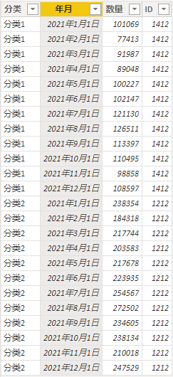
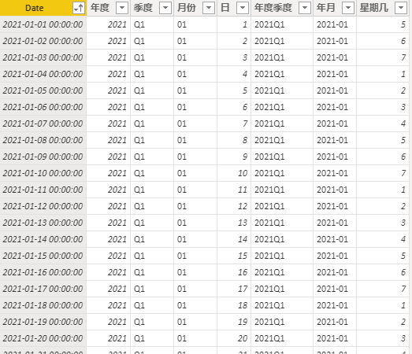
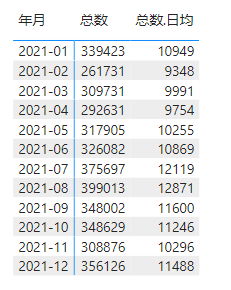
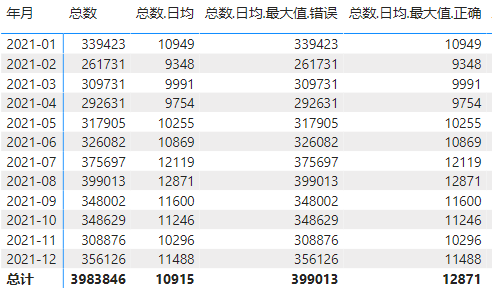
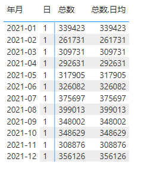
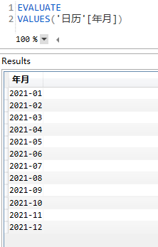

toc: true
title: 月度数据计算日均最大值
date: 2022-02-21 16:28
tags: [PowerBI, 月度, 日均, 最大值]
description:

---

# 问题产生

在只有月度数据的情况下，计算日均数据、日均数据最大值。

这个问题看起来简单，实际计算最大值的时候，要充分理解迭代函数按行迭代的行为，否则很容易踩坑。

<!--more-->

## 模型

1. 数据表



数据表只包含月度数据，其中数据表的年月字段是日期值，具体为每个月的1号。

2. 日历表



日历表包含了连续的所有日期。

3. 关系


4. 度量值

```
总数 = SUM('数据'[数量])

总数.日均 = DIVIDE([总数], DISTINCTCOUNT('日历'[Date]))
```

结果为




到目前为止都是正常的。下面计算容易踩坑的日均最大值。

## 计算日均最大值

先给出两个计算方法，第一种错误，第二种正确。

```
总数.日均.最大值.错误 = MAXX('日历', [总数.日均])

总数.日均.最大值.正确 = MAXX(VALUES('日历'[年月]), [总数.日均])
```

结果为




## 分析

MAXX是迭代函数，迭代表的每一行，计算表达式的最大值。

错误的公式迭代了日历表的每一行，根据数据表，只有在每个月1号才有具体的值



根据日均总数计算公式，将这个值累加以后（每个月的数量）除以天数（1天），还是每个月的数量，其它天数都没有数据，为NULL，因此最后得到的实际上是总数和总数的最大值。

正确的公式迭代根据日历表年月字段生成的表，也就是按月迭代。



根据日均总数的计算公式，将每个月每天的数量累加，除以这个月的天数，即为正确的日均总数，最后得到正确的日均总数最大值。


