toc: true
title: 用EXCEL爬取网页获得基金重仓股票数据
date: 2021-03-20 
tags: [EXCEL, PowerQuery, 基金]
description:

---

# 用EXCEL爬取网页获得基金重仓股票数据

前面文章用Python和Powershell爬取网页，获得基金数据，再导入到EXCEL进行分析。

后来发现使用PowerQuery for EXCEL可以直接抓取网页数据，功能很强大。

<!--more-->

# M代码

```
let
    源 = Excel.CurrentWorkbook(){[Name="表1"]}[Content],
    更改的类型 = Table.TransformColumnTypes(源,{{"基金代码", type text}, {"基金名称", type text}}),
    已添加自定义 = Table.AddColumn(更改的类型, "自定义", each Json.Document(Web.Contents("https://danjuanapp.com/djapi/fund/detail/"&[基金代码]))),
    #"展开的“自定义”" = Table.ExpandRecordColumn(已添加自定义, "自定义", {"data"}, {"data"}),
    #"展开的“data”" = Table.ExpandRecordColumn(#"展开的“自定义”", "data", {"fund_position"}, {"fund_position"}),
    #"展开的“fund_position”" = Table.ExpandRecordColumn(#"展开的“data”", "fund_position", {"stock_list"}, {"stock_list"}),
    #"展开的“stock_list”" = Table.ExpandListColumn(#"展开的“fund_position”", "stock_list"),
    #"展开的“stock_list”1" = Table.ExpandRecordColumn(#"展开的“stock_list”", "stock_list", {"name", "code", "percent", "current_price"}, {"name", "code", "percent", "current_price"}),
    更改的类型1 = Table.TransformColumnTypes(#"展开的“stock_list”1",{{"name", type text}, {"code", type text}, {"percent", type number}, {"current_price", type number}}),
    被除的列 = Table.TransformColumns(更改的类型1, {{"percent", each _ / 100, type number}}),
    重命名的列 = Table.RenameColumns(被除的列,{{"name", "重仓股票"}, {"code", "股票代码"}, {"percent", "持仓比例"}, {"current_price", "股票现值"}})
in
    重命名的列
```

# 图形界面过程

## 基金列表导入Power Query

在EXCEL中输入基金列表，包括基金代码和基金名称，然后选中基金列表，再选中菜单`数据`-`来自表格区域`，将基金列表导入PQ。

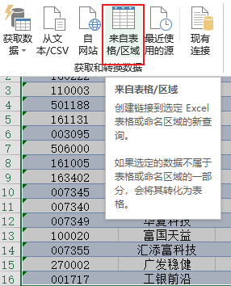

导入PQ后，基金代码自动识别为数字型，0开头的基金代码都不对，在右侧`应用的步骤`删除步骤`更改的类型`，并将基金代码设为文本型。

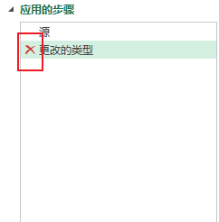

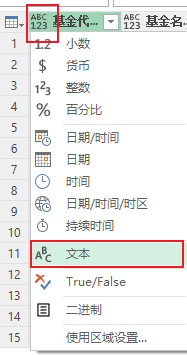

## 增加自定义列

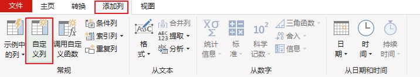

输入自定义列公示

```
Json.Document(Web.Contents("https://danjuanapp.com/djapi/fund/detail/"&[基金代码]))
```

如图

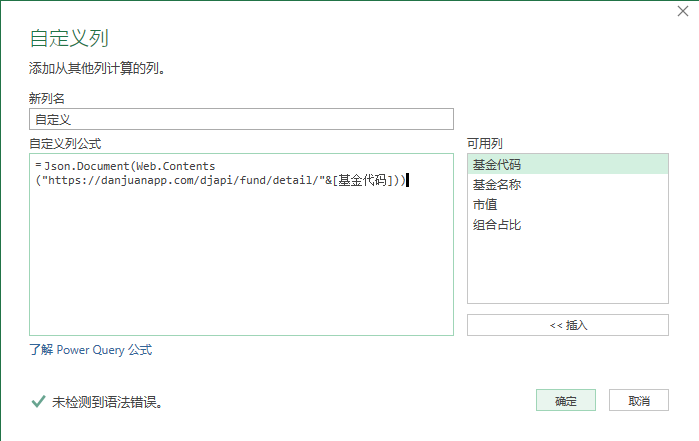

## 展开自定义列，定位到所需要的节点

上面输入的URL返回JSON信息，包括了我们需要的基金持仓的数据，节点为

```
data.fund_position.stock_list
```

按照上面的节点顺序，依次展开自定义列

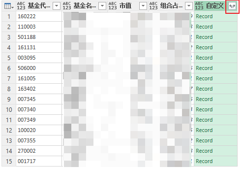

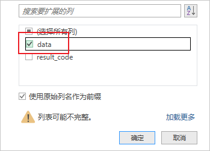

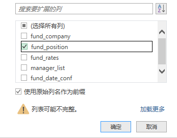

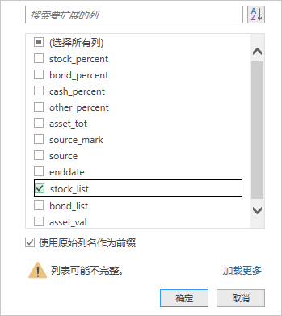

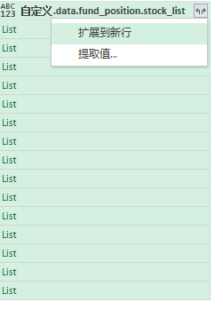


最后一步选择前4列，这是我们需要的基金持仓数据

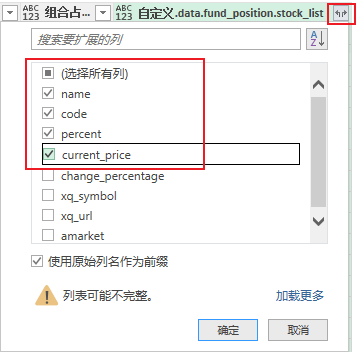

最后修改列名、列类型，并将数据返回EXCEL，完成。


