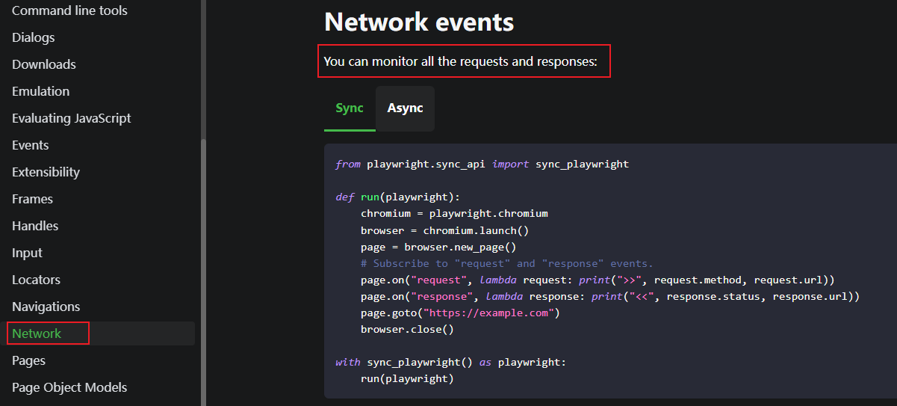

toc: true
title: 用PlayWright抓取动态页面
date: 2022-03-05 23:14
tags: [PlayWright, XHR]
description:

---

# 动态网页

网页用XHR局部获取数据，要抓这样的数据，需要找到XHR的URL，这样的URL一般包括token，一段时间后就失效，因此需要动态抓取网页发起的请求。

<!--more-->

```
XHR含有Token的URL

https://****/****?Id=5&token=99aeacc27dc64c1124f1e25dc0666c10
```

# PlayWright

[PlayWright](https://playwright.dev/python/)是微软开发的浏览器模拟神器，其中[Network Event](https://playwright.dev/python/docs/network)能监控网页发出的请求和响应。



将其中代码稍作修改，即可满足需求

1. 只监控response
2. 如果response.url中包含关键字，则输出相应的url

```Python
from playwright.sync_api import sync_playwright

def run(playwright) -> None:
    # browser = playwright.chromium.launch(headless=False)
    browser = playwright.chromium.launch()
    context = browser.new_context()

    # Open new page
    page = context.new_page()

    # page.on("request", lambda request: print(request.url))
    page.on("response", res)

    # Go to
    page.goto("https://****/****")

    # ---------------------
    context.close()
    browser.close()

def res(res) -> None:
    if "id" in res.url:
        print(res.url)

with sync_playwright() as playwright:
    run(playwright)
```

# 后续

1. PowerBi支持调用Python返回数据集，response.json()能返回json格式的数据，导入pandas再返回PowerBi，应该可以直接得到数据集。
2. PlayWright支持C#，理论上应该能用VSTO将数据返回给EXCEL。

