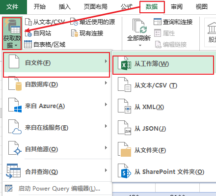
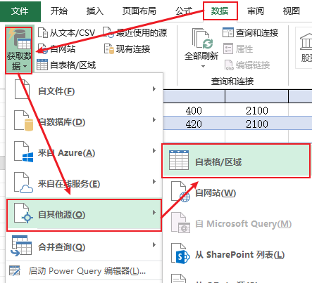
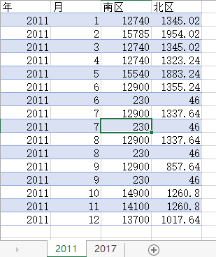
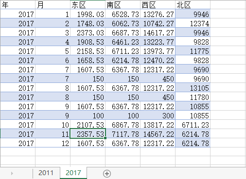
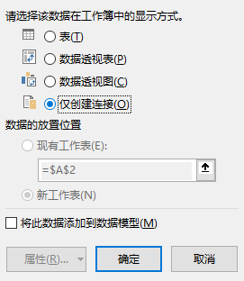
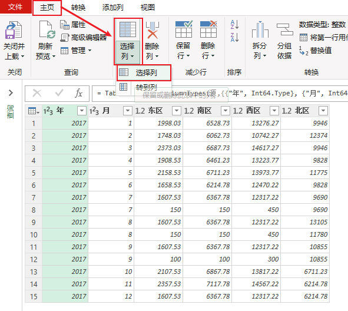
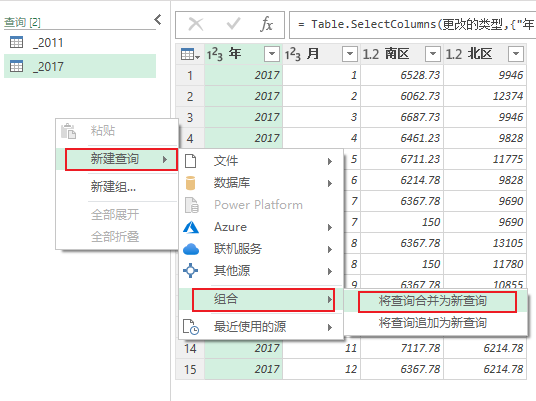
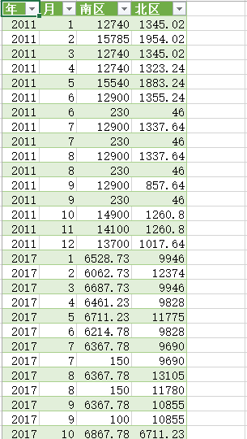

toc: true
title: 用PowerQuery制作多表数据透视表
date: 2020-01-05 11:08
tags: [PowerQuery, 数据透视表, 相对路径]
description: 

------

# 背景

在EXCEL中基于一张Sheet制作数据透视表是现代人的基本功，那么如何进行多Sheet的数据透视表呢？网上的教程有很多，最灵活的是使用强大的PowerQuery进行数据整合，整合成一张表后再制作数据透视表。

<!-- more -->

使用PowerQuery进行基于EXCEL的数据整合，一般都是用选择一个EXCEL文件，实际上是用一个外部EXCEL文件做为PowerQuery数据源，使用了文件的绝对路径，移动了这个EXCEL文件，PowerQuery就会报错。如果要整合同一个EXCEL文件中多个Sheet，就会显得很奇怪：明明只有一个文件，这个文件有源数据，有整合好的数据，有数据透视表，但是却不能移动位置，否则就会出错。

需要通过相对路径访问外部数据源，或者直接使用内部Sheet。

# PowerQuery使用内部Sheet的思路

EXCEL`数据-获取数据-自其它源-自表格区域`可以直接访问EXCEL的表（TABLE）和区域，，所以我们可以先将数据创建表，再将创建的表引入PowerQuery，进行数据整理，整理好的数据再上载回EXCEL。

# PowerQuery使用内部Sheet的具体过程

## 准备数据

2011年南区北区的销售数据和2017年东南西北区的销售数据

现在要求使用PowerQuery将2011年和2017年南区北区销售数据整合在一张表中

## 生成TABLE，命名为_2011和_2017

`插入-表格`，将表格分别命名为_2011和_2017

顺便说一句，使用表格是EXCEL中结构化数据的起点，大家应该多用。

## PowerQuery生成查询

选中表_2011，然后`数据-获取数据-自其它源-自表格区域`打开PowerQuery，同时引入表_2011，由于数据不需要再做整理，可以直接上载回EXCEL。上载回EXCEL默认是创建新的表，为了避免生成重复的数据，这里使用创建链接方式上载。 

同样操作_2017，_2017多了两列，要将这两列去除，也是在PowerQuery中操作，如下图。
 
 

## 两个查询合并
将两个查询合二为一。这里只是简单的行拼接，所以使用追加查询。  

新生成的查询命令为Total，使用创建新表的方式上载回EXCEL。这样就完成了数据整理。

当源数据改变的时候，包括增删减数据，合并好的数据也会自动更新，十分好用。

# 后记

第一次写多图的文章，也是第一次写基于GUI操作的文章，算是一个新的开端。

