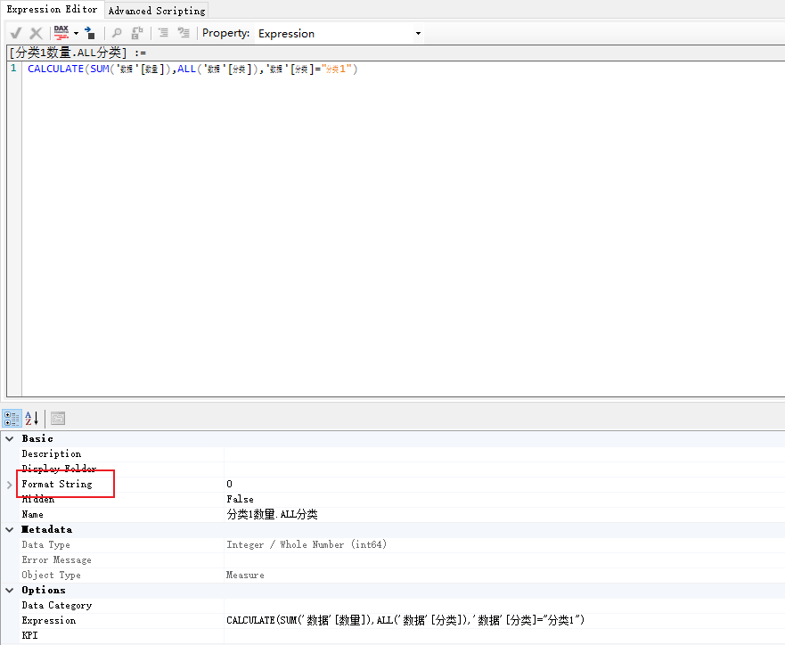
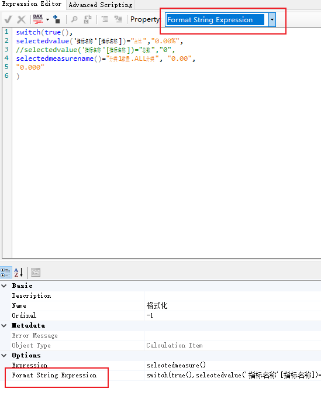
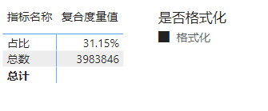
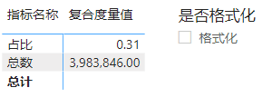
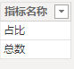
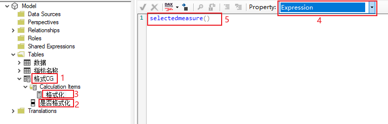
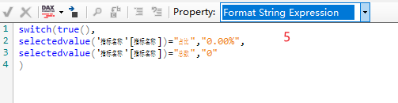
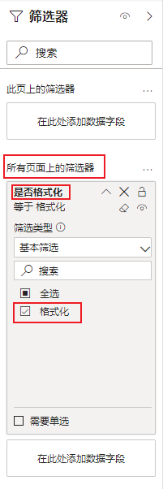

toc: true
title: 用计算组实现全局动态格式
date: 2022-02-11 14:13
tags: [PowerBI, 计算组, 动态格式]
description:

---

# 动态格式

复合度量值，也就是一个度量值中包括多个计算项目。这在实际动态切换度量值中很有用。不同的计算项目需要的格式也不同，比如占比需要%，总量需要整数等。

PowerBI中的度量值格式只能是格式字符串(FormatString)，不能是格式字符串表达式(FormatStringExpression)，也就是说PowerBI度量值只能是一种格式，而计算组的计算项可以用表达式做为格式，可以实现动态格式。

<!--more-->



普通`度量值`只能是格式字符串




`计算项`可以是格式字符串表达式


# 动态格式具体实现过程

先看最终的结果



指标名称做为矩阵的行标题，一个复合度量值能同时显示每个指标的指标值，同时根据指标的不同，显示%或者整数。

注意，当筛选器取消勾选的时候，动态格式失效。



下面讲讲过程

构建一个指标名称表，列出所有需要计算的指标，如图



再构建一个复合度量值，如下

```
复合度量值 = SWITCH(TRUE(),
SELECTEDVALUE('指标名称'[指标名称])="占比", DIVIDE(CALCULATE(SUM('数据'[数量]),ALL('数据'[分类],'数据'[ID]),'数据'[分类]="分类1"),SUM('数据'[数量])),
SELECTEDVALUE('指标名称'[指标名称])="总数",SUM('数据'[数量])
)
```

再使用TabularEditor生成格式计算组



如何生成计算组不再赘述，可以查到很多资料，主要步骤为

1. 新建一个计算组，取名格式CG（格式CaculationGroup）
2. 为了便于显示，将名称改为是否格式化
3. 新建一个计算项，取名格式化
4. 计算项的表达式为selectedmeasure()
5. 生成计算项的格式表达式



具体表达式为
```
switch(true(),
selectedvalue('指标名称'[指标名称])="占比","0.00%",
selectedvalue('指标名称'[指标名称])="总数","0"
)
```

将指标名称、复合度量值分别拖到矩阵的行和值，是否格式化拖到筛选器中，就会得到预期的结果

# 动态格式的全局应用

仔细看动态格式的实现过程，就会发现它和具体哪个度量值没有关系。实际上只要在格式表达式中将需要的统计指标找出来就可以随意指定相应的格式，如果在Switch语句默认值上指定格式，则筛选器作用范围内的所有格式都会收到这个计算项的影响。比如格式表达式改为

```
switch(true(),
selectedvalue('指标名称'[指标名称])="占比","0.00%",
//selectedvalue('指标名称'[指标名称])="总数","0",
selectedmeasurename()="分类1数量.ALL分类", "0.00",
"0.000"
)
```

相对应的格式为


其中图中标注第二行、第四行和第五行默认值分别受到switch的第二行、第四行和第五行默认值的影响，值得注意的是标有`**`的单元格，同时受到第二行和第四行的影响，但是第二行优先，最终结果是第二行的格式。

如果将这个筛选器放到`所有页面筛选器`中，则影响全局度量值的格式。



